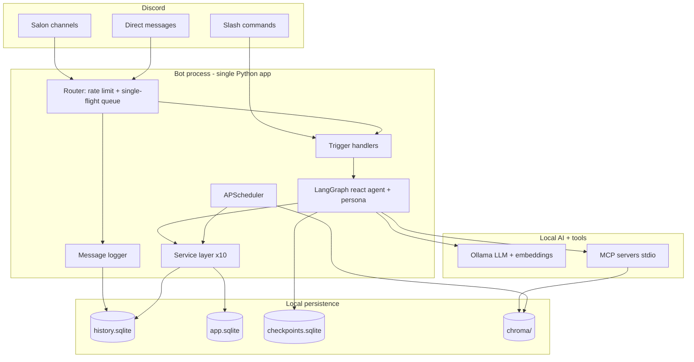

# Tramice721 Discord Bot — Implementation Plan

Local-first, model-swappable Discord bot that **is Tramice721** — the social AI
assistant from Annexe D of the game document, simulating the personal *tramice*
console for the *Laboratoire tramiciel n°721* playtest of **La Guilde des
Tramarades**.

This plan operationalizes:
- [`docs/requirements.md`](../../docs/requirements.md) — what the bot must do (service-tagged).
- [`docs/specifications.md`](../../docs/specifications.md) — how it is built (architecture, schemas, APIs, acceptance criteria).

The full agentic stack (LangGraph + MCP + RAG) is the target, delivered in
milestones so a working persona bot exists after M1.

## Confirmed decisions
- **Scope:** full agentic stack organized as ten services (6 community + 4 supporting) — see requirements §2.
- **The bot is a specific persona** (Tramice721, she/her, French Québec), not a generic chatbot — see requirements §3.
- **Service-oriented monolith:** one deployable process; services are Python modules with explicit interfaces (spec §2.3, §5).
- **Propose, never dispose:** tools return proposals; HOP placement, votes, events, matchmaking DMs need explicit human confirmation (requirements NFR-1, MTM-3, GOV-2).
- **Simulation, not ledger:** HOP balances/placements are playtest records in SQLite, not a financial system.
- **Triggers:** prefix (`!ai`), `@mention`, slash commands (spec §7.3).
- **Logging:** all readable messages logged per channel policy, gated by social norms + data classification (spec §10.2).

## Environment (detected on this machine)
- Python 3.12.3; Ollama 0.31.2 installed; 16 CPU cores, ~15 GB RAM, no NVIDIA GPU (CPU-only inference).
- `venv/` already has langchain 1.3.x installed; a `docs/` folder holds `jeu.pdf`.
- Implication: `qwen2.5:7b-instruct` (~5 GB, best small tool-caller) is the default. One LLM loaded at a time; model swap = reload. Single in-flight inference → router queue is mandatory. `gemma2:9b`/`phi3.5`/`mistral` are chat-only/experimental fallbacks (weak tool callers).

## Target architecture

## Services → milestone matrix

| Service | Primary milestone | Notes |
| --- | --- | --- |
| `[persona]` | M1 (M6 Modelfile) | system prompt applies across all services |
| `[platform]` | M1 | client, triggers, router, rate limit/queue |
| `[community-memory]` | M2 | message log, `/forgetme`, checkpointer, daily summary (M5) |
| `[identity]` | M2/M4 | trammer + volio + confidences (M2); dashboards + trust (M4) |
| `[knowledge]` | M3 | Chroma RAG, source attribution, `/reindex` |
| `[matchmaking]` | M4 | synergies, échos; propose-only |
| `[coordination]` | M4 | events, RSVPs, teams |
| `[ecosystem-mapping]` | M4 | Mondo perso/cosmo, entity dashboards |
| `[governance]` | M4/M5 | summaries + norms (M4); votes, jury, tribunal (M5) |
| `[game]` | M5 | weekly cycle, HOP rules, missions/quests/placements |
| `[administration]` | M1→M6 | `/model` (M1), `/reindex` (M3), guardrails/audit (M6) |

## Tech stack / dependencies
Expand [requirements.txt](../../requirements.txt) (currently `discord.py` + deps), pinned at install time:
- `ollama`, `python-dotenv`, `pyyaml`, `apscheduler`, `tzdata`
- `chromadb`, `langchain`, `langchain-community`, `langchain-ollama`
- `langgraph`, `langgraph-checkpoint-sqlite`
- `langchain-mcp-adapters`, `mcp`, `fastmcp`
- PDF ingest: `pypdf` (for `jeu.pdf`)
- (optional later) `llama-index`, `langgraph-checkpoint-postgres`

## Project structure (spec §2.4)
- `bot/` — `main.py` (entrypoint), `config.py`, `discord_client.py`, `router.py` (rate limit + single-flight queue), `handlers.py`
- `services/` — `identity.py`, `matchmaking.py`, `coordination.py`, `game.py`, `ecosystem.py`, `governance.py`, `knowledge.py`, `memory.py`, `platform.py`
- `ai/` — `ollama_client.py`, `persona.py` (system-prompt builder), `agent/{state,graph,tools}.py`, `rag/{ingest,retriever,embeddings}.py`
- `mcp_servers/` — `discord_helper/server.py`, `rag_server/server.py`, `mcp_config.py`
- `storage/` — `db.py` (connections + migrations), `history.py`, `models.py`
- `scheduler/` — `jobs.py`
- `prompts/` — `tramice721_system.txt`, `tramice721_modelfile` (M6)
- `data/` (gitignored) — `history.sqlite`, `app.sqlite`, `checkpoints.sqlite`, `chroma/`
- root — `config.yaml`, `.env.example`, `.gitignore`, `README.md`

> Note on `docs/`: RAG source lives at the top-level `docs/` folder (`jeu.pdf`, `Discord and AI.pdf`, `requirements.md`, `specifications.md`). M0 points `rag.docs_path` at `docs/`; never index `venv/`.

## Milestones

### M0 — Foundation
`git init`, `.gitignore` (ignore `data/`, `.env`, `venv/`); expand `requirements.txt`; create `config.yaml` + `.env.example` (spec §9); scaffold the package structure; implement `storage/db.py` to create `app.sqlite` + `history.sqlite` schemas (spec §4) and bootstrap default `social_norms` (spec §9.3).
**Deliverable:** repo initialized, config loads, DB schemas created.

### M1 — Working persona bot `[platform]` `[persona]`
discord.py client with intents (message_content, members, guilds); `!ai` prefix, `@mention`, `/ask`; `bot/router.py` single-flight queue + per-user/channel rate limits (spec §3.1); `ai/persona.py` builds the Tramice721 system prompt (requirements §3); direct Ollama call; surface-aware addendum (salon vs DM, spec §3.2/§7.4); `/model` swap; must not reply to other bots.
**Deliverable:** Tramice721 answers in Discord, in character.

### M2 — Persistence + memory `[community-memory]` `[identity]`
SQLite message logging honoring channel allow/deny + `log_mode` (spec §4.1, §10.2); `/forgetme` soft-delete of messages + profile rows; LangGraph `SqliteSaver` checkpointer with `thread_id=f"{user_id}-{channel_id}"`; `trammers`, `volios`, `confidences` tables + `IdentityService` basics; confidences never enter RAG/summaries (IDN-6, MEM-3).
**Deliverable:** multi-turn memory per user/channel; logging + deletion; profiles start forming.

### M3 — Knowledge / RAG `[knowledge]`
`nomic-embed-text` embeddings → Chroma; ingest `docs/` (`jeu.pdf` via `pypdf`, `requirements.md`, `specifications.md`) into `docs` collection and logged history into `history` collection (spec §4.4); `KnowledgeService.search` + `explain_topic` returning `sources[]` (NORA, KNW-1/2); `/reindex` admin command.
**Deliverable:** grounded Q&A about HOP, weekly cycle, carnets with source hints.

### M4 — MCP + community services `[identity]` `[matchmaking]` `[coordination]` `[ecosystem-mapping]` `[governance]`
Build `discord_helper` (`get_server_overview`, `fetch_channel_history`) and `rag_server` (`semantic_search`) FastMCP servers (stdio); wire `MultiServerMCPClient` → `get_tools()` → bind to react agent; implement service modules + LangChain tool wrappers (spec §5, §6.1); slash commands `/volio`, `/mondo`, `/echoes`, `/event`, `/summarize`, `/normes`; matchmaking returns proposals only (no auto-DM, MTM-3); `discord.ui.View` confirmation buttons for mutations (spec §7.3); optional read-only fetch MCP scoped to `latramice.net` (feature-flagged off).
**Deliverable:** volios, Mondo overview, échos, event proposals, channel summaries, readable social norms.

### M5 — Scheduling + game `[game]` `[governance]` `[community-memory]`
APScheduler jobs (spec §8, `America/Montreal`): `index_new_messages` (nightly), `refresh_knowledge_base` (weekly), `build_daily_summary` (to `summary_channel_id`), `game_week_open` (Thu 17:00), `game_week_close` (Sun 23:59); `GameService` with HOP rules (2 decimals, min 5 / max 100 invest, cap 99 999,99, no negatives — GME-5); `/mission`, `/place`, `/vote` with confirmation; `GovernanceService` votes/threshold, `file_signalement`, `draw_jury` (7, non-conflicted, seeded), tribunal + jurisprudence tables.
**Deliverable:** weekly cycle simulation runs on schedule; placements/votes/reports/juries functional.

### M6 — Guardrails + productionizing `[persona]` `[governance]` `[administration]`
Tramice721 Ollama Modelfile from `prompts/`; input sanitization (strip `@everyone`/`@here`), output data-classification enforcement (spec §10.2/§10.3), feminine self-reference + link allowlist post-checks; rate limit/queue tuning under load; structured JSON logging + append-only audit log (spec §10.4, §11.2); health check on startup + optional `/health`; run scripts + optional systemd unit / Docker Compose (ollama + bot + mcp).
**Deliverable:** hardened, observable, deployable bot.

## Acceptance criteria
Per-milestone checklists are defined in **specifications §12** and are the source of truth for "done".

## Tasks for YOU (need your accounts/hardware/decisions)
1. **Discord Developer Portal:** create Application → Bot → copy token. Enable **Message Content** + **Server Members** intents. OAuth2 invite URL with `bot` + `applications.commands` scopes and permissions: Send Messages, Read Message History, Use Slash Commands (and Mention @everyone only if you enable announcements).
2. Put the token in `.env` as `DISCORD_TOKEN=...` (M0 provides `.env.example`).
3. **Ollama:** `ollama serve`, then `ollama pull qwen2.5:7b-instruct` and `ollama pull nomic-embed-text`.
4. **Privacy/legal:** since we log messages, post an AI-logging notice / server rule (GDPR-style). Confirm channel **allowlist vs log-all**.
5. Provide **target guild ID** and the **channel for daily summaries**.
6. Optional: GPU box / second LAN machine for faster/larger models.

## Open decisions (blockers — spec §14, requirements §9)
1. `GUILD_ID` + `summary_channel_id`.
2. `log_mode: allowlist` vs `all` (+ privacy notice wording).
3. Game **enforce** rules vs merely **assist** the human-run simulation (affects `GameService` strictness).
4. Confirm `qwen2.5:7b-instruct` as the default persona "soul".
5. Enable `@everyone` announcements? Behind which permission?
6. Default social norms (public/private) for the playtest.

## Key risks
- **CPU-only + 15 GB RAM:** 7B is the practical ceiling; multi-second latency, single-request serialization (router queue mandatory). Larger models swap slowly.
- **Small-model tool calling is imperfect:** keep tools few, well-described, `requires_confirmation` on mutations; cap tool calls/turn (spec §3.2); prompt-engineering fallbacks.
- **Privacy:** logging + matchmaking over personal data → enforce data classification + social norms in code, not just prompt (spec §10).
- **Persona fidelity vs safety:** persona must stay in character (feminine French, NORA) while guardrails strip unsafe output — handled by M6 post-checks.
- **Scope creep:** game simulation is the largest domain; keep it "best-effort simulation," defer the distributed ledger (out of scope).
