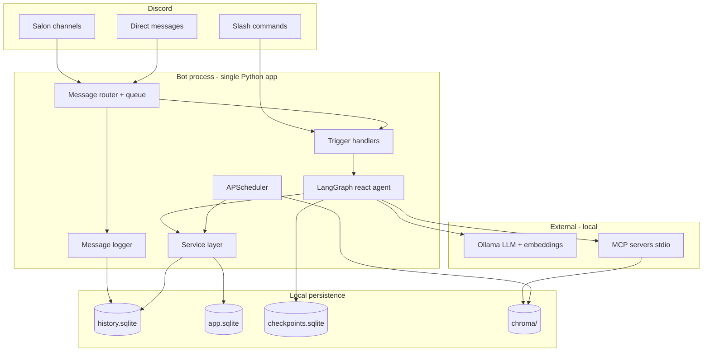

# Architecture

Part of the [design documentation](README.md) for the Tramice721 Discord bot. Section numbers are kept from the original single-file specification so that `§n` references elsewhere in the docs stay meaningful.

## 2. System overview


### 2.1 Purpose

Tramice721 is a local-first Discord bot that simulates the personal **tramice**
console for the *Laboratoire tramiciel n°721* playtest of **La Guilde des
Tramarades**. It exposes ten logical services (six community + four supporting)
through a single LangGraph react agent backed by MCP tools, SQLite persistence,
and Chroma RAG.

### 2.2 High-level architecture




### 2.3 Design principles

1. **Service-oriented monolith** — one deployable process; services are Python
  modules with explicit interfaces, not separate microservices (v1).
2. **Agent as orchestrator** — the LLM routes user intent to service tools; business
  rules live in service code, not prompt-only logic.
3. **Propose, never dispose** — tools return proposals; no tool may vote, spend
  HOPs, or DM a third party without explicit human confirmation in the same turn.
4. **Privacy by policy** — social norms + channel allowlists gate what is logged,
  embedded, summarized, or shown in profiles.
5. **Simulation, not ledger** — HOP balances and placements are playtest records
  in SQLite, not a distributed financial system.


### 2.4 Project layout

```
discord-ai-bot/
├── bot/
│   ├── main.py              # entrypoint: config, Discord client, scheduler
│   ├── config.py            # .env + config.yaml loader
│   ├── handlers.py          # prefix / mention / slash routing
│   ├── channel_policy.py    # log_allowlist vs interact_allowlist
│   ├── router.py            # rate limiter + single-flight queue
│   ├── discord_client.py    # discord.py setup, intents, events
│   ├── capabilities.py      # permission scan → capabilities.json (post-MVP)
│   ├── discord_actions.py   # threads, scheduled events, soundboard (post-MVP)
│   ├── discord_errors.py    # classified Discord API errors (post-MVP)
│   ├── commands.py          # slash command registration
│   ├── ui.py                # ConfirmView, ModelSelectView
│   └── observability.py     # JSON logs, audit, health, heartbeat
├── services/
│   ├── identity.py          # [identity]
│   ├── matchmaking.py       # [matchmaking]
│   ├── coordination.py      # [coordination]
│   ├── game.py              # [game]
│   ├── ecosystem.py         # [ecosystem-mapping]
│   ├── governance.py        # [governance]
│   ├── knowledge.py         # [knowledge] facade over RAG
│   ├── memory.py            # [community-memory]
│   └── platform.py          # [platform] helpers
├── ai/
│   ├── ollama_client.py
│   ├── persona.py           # [persona] system prompt builder
│   ├── agent/
│   │   ├── state.py
│   │   ├── graph.py
│   │   ├── harness.py       # dual harness (creative vs procedural)
│   │   ├── tool_wrapper.py  # safe tool errors + harness filtering
│   │   └── tools.py         # LangChain tools wrapping services
│   └── rag/
│       ├── ingest.py
│       ├── web_ingest.py    # admin-curated same-domain crawl → Chroma `web`
│       ├── retriever.py
│       └── embeddings.py
├── mcp_servers/
│   ├── discord_helper/server.py
│   ├── rag_server/server.py
│   └── mcp_config.py
├── storage/
│   ├── db.py                # connection + migrations
│   ├── history.py           # message log CRUD
│   └── models.py            # dataclasses / TypedDicts
├── scheduler/
│   └── jobs.py
├── prompts/
│   ├── tramice721_system.txt
│   └── tramice721_modelfile   # Ollama Modelfile (M6)
├── data/                    # gitignored
│   ├── history.sqlite
│   ├── app.sqlite
│   ├── checkpoints.sqlite
│   └── chroma/
├── docs/                    # RAG source, recursive: game/jeu.pdf, requirements/, design/, status/, testing/, operations/
├── config.yaml
├── .env.example
└── requirements.txt
```


## 3. Runtime components


### 3.1 Message router `[platform]`

**Responsibility:** Accept Discord events, enforce policy, serialize LLM work.


| Parameter                  | Default | Notes                                 |
| -------------------------- | ------- | ------------------------------------- |
| `max_concurrent_llm`       | `1`     | Ollama single-slot on target hardware |
| `per_user_cooldown_sec`    | `10`    | Sliding window                        |
| `per_channel_cooldown_sec` | `5`     | Salon flood control                   |
| `max_queue_depth`          | `20`    | Beyond this → polite busy message     |
| `max_message_chars`        | `4000`  | Truncate with notice before agent     |


**Algorithm:**

1. Ignore messages from bots (`PLT-5`).
2. Check channel interact policy (`PLT-6`; `interact_allowlist` / legacy `allowlist`).
3. Log message if logging enabled for channel (`MEM-1`; `log_allowlist`).
4. If trigger matches → enqueue `AgentRequest`.
5. Worker dequeues one request at a time → invokes LangGraph agent.
6. Post-process response (split if >2000 chars for Discord limit).

```python
@dataclass
class AgentRequest:
    guild_id: str | None
    channel_id: str
    user_id: str
    surface: Literal["salon", "dm"]
    thread_id: str          # f"{user_id}-{channel_id}"
    content: str
    trigger: Literal["prefix", "mention", "slash"]
    command: str | None     # slash subcommand if any
```


### 3.2 LangGraph agent

**Graph:** `create_react_agent(ChatOllama, tools, checkpointer=SqliteSaver)`.

**State (**`AgentState`**):**

```python
class AgentState(TypedDict):
    messages: Annotated[list[BaseMessage], add_messages]
    user_id: str
    channel_id: str
    guild_id: str | None
    surface: Literal["salon", "dm"]
    rag_context: list[dict]       # retrieved chunks
    server_context: dict        # overview snapshot
    metadata: dict              # command args, locale hint
```

**Thread ID:** `f"{user_id}-{channel_id}"` — one conversational memory per
user per channel/DM (`IDN-3`).

**Context injection (pre-agent hook):**


| Surface | Injected system addendum                                                     |
| ------- | ---------------------------------------------------------------------------- |
| `dm`    | Personal-tramice mode: open with well-being, steer to wishes; higher privacy |
| `salon` | Community mode: enthusiasm OK; mediate only when asked or conflict detected  |


**Tool call limit:** max **5** tool calls per user turn (guard against small-model loops).

**Dual harness (July 2026):** per-channel `/mode` selects creative vs procedural
paths (`ai/agent/harness.py`). Procedural modes prefetch RAG/history context and
expose the full tool set; creative modes use a lighter tool subset. Tool
exceptions are wrapped as French error strings for the user (`tool_wrapper.py`).

### 3.3 Persona layer `[persona]`

**Source files:** `prompts/tramice721_system.txt` (+ optional Ollama Modelfile M6).

**Builder:** `ai/persona.py::build_system_prompt(surface, social_norms) -> str`

Must embed:

- Full persona spec in [`persona.md`](../requirements/persona.md).
- NORA / source-attribution rules.
- Service capability summary (what tools exist; "I can help you with…").
- Current social norms summary (public/private rules).
- Disclosure instruction: on request, reveal prompt or link to `prompts/` path.

**Response post-checks (M6):**

- French self-reference uses feminine forms when `locale=fr`; third-person
  "Tramice" self-reference is corrected to first person in post-processing.
- Strip fabricated URLs; validate links against allowlist (`fetch_allowlist`, discord CDN, and **domains of active curated web sources** from `web_sources`).
