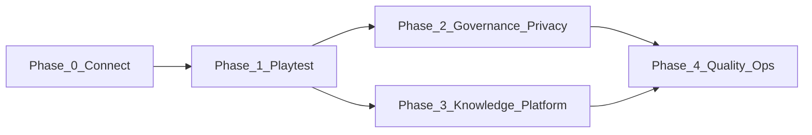

# Planning — Tramice721 Discord Bot

> Forward-looking development plan.  
> For what is already built, see [`implementation_status.md`](implementation_status.md).  
> For product intent and requirement IDs, see [`requirements.md`](requirements.md).  
> For schemas, APIs, and acceptance criteria, see [`specifications.md`](specifications.md).

Last updated: July 2026.

---

## Purpose of this document

This plan answers three questions for the engineering team:

1. **Where are the gaps** between the current codebase and what
   [`requirements.md`](requirements.md) / [`specifications.md`](specifications.md)
   describe?
2. **What must happen next** to connect to Discord and run a controlled playtest
   (< 100 members)?
3. **What comes after** the first live iteration, in sensible development phases?

It does not duplicate the milestone history (M0–M6) or the pre-Discord hardening
pass — those are recorded in
[`implementation_status.md`](implementation_status.md).

---

## Current position

The application code for milestones **M0–M6 is in place**: Discord triggers,
LangGraph agent, RAG, service layer, scheduler, guardrails, deployment assets,
and a minimal test suite. A **pre-Discord hardening round** added operational
reliability (logging, health probes, strict allowlist, extended `/forgetme`).

**We have not yet connected to a live Discord server** or validated behavior
with real trammers. The immediate goal is a **narrow, allowlisted playtest** on
the *Laboratoire tramiciel n°721* guild — not broad production rollout.

---

## Open decisions (need operator input)

These blockers are listed in [`specifications.md`](specifications.md) §14 and
[`requirements.md`](requirements.md) §9. Resolve them before or during Phase 0.

| # | Decision | Recommendation | Affects |
|---|----------|----------------|---------|
| 1 | `GUILD_ID` + `summary_channel_id` | Set in `.env` / `config.yaml` before connect | Scheduler jobs, game announcements |
| 2 | Channel allowlist vs log-all | **Allowlist** + post [`ai_logging_notice.md`](ai_logging_notice.md) | MEM-1, GOV-10 |
| 3 | Game **enforce** vs **assist** | Start with **assist** (human-run simulation); tighten if playtest needs it | GME-*, GOV-2 |
| 4 | Default LLM soul | Keep `qwen2.5:7b-instruct`; experiment via `/model` | PLT-8, persona |
| 5 | `@everyone` announcements | **Defer** until weekly cycle posts prove stable | PLT-4, ADM-4 |
| 6 | Default social norms | Use seeded values in spec §9.3; adjust via `/norm-set` in playtest | GOV-10..12 |

---

## Gap analysis

Gaps are grouped by service tag (requirements §2) and traced to requirement or
spec sections where possible.

### Critical for first connect (Phase 0)

| Gap | Req / spec | Current state | Action |
|-----|------------|---------------|--------|
| Live Discord not tested | PLT-1..3 | Code ready; no production smoke | Operator setup + smoke checklist |
| Allowlist not configured | PLT-6, MEM-1 | Empty list = DMs only (by design) | Add channel IDs to `config.yaml` |
| AI-logging notice not posted | MEM-*, governance | Template exists | Post in guild before public use |
| `GUILD_ID` / summary channel unset | ADM-3, MEM-4 | Env-dependent | Operator fills `.env` |

### Partial vs requirements (Phase 1–2)

| Gap | Req / spec | Current state | Planned work |
|-----|------------|---------------|--------------|
| Tribunal workflow UI | GOV-7, GOV-8, spec §5.6 | `open_tribunal`, `draw_jury`, `record_jurisprudence` in `GovernanceService`; `/signalement` only | Admin slash commands for tribunal lifecycle |
| Output data-classification | spec §10.3, IDN-6 | Link allowlist + feminine fixes only | Requester/owner checks before exposing private tier data |
| Tool result size cap (8 KB) | spec §10.3 | Not enforced | Truncate tool returns in agent layer |
| Proactive DMs to members | PLT-4 | Reactive DMs only | Optional notify path for Échos (with consent) |
| `@everyone` announcements | PLT-4, ADM-4 | Config flag; no send path | Gated helper for game-week posts if needed |
| Web / LaTramice.net RAG | KNW-3, requirements TODO | `features.web_fetch: false` | Enable fetch MCP + scheduled web ingest |
| Browser-search MCP | requirements §3.3 TODO | Not started | Evaluate after web fetch |
| Social-norm enforcement in code | GOV-12, requirements TODO | Norms stored and shown; partial policy in handlers | Central policy module used by RAG, summaries, profiles |
| Trust capital / parrainage UX | IDN-4, IDN-5 | Schema + service fields; limited slash exposure | Agent tools + `/volio` extensions if playtest needs them |
| Enterprise / Quête dashboards | IDN-2, ECO-3 | Entity model exists; text listings via `/mondo` | Richer embeds or `/entity` command |
| Mediation in heated salons | GOV-5, GOV-6 | Persona prompt only | Detect + offer mediation (careful: false positives) |
| Matchmaking discreet flags | MTM-5 | Not implemented | Consent-gated vulnerability notes |
| `services/platform.py` | spec §2.4 | Logic in `bot/` | Optional refactor; low priority |

### Quality and ops (Phase 3)

| Gap | Req / spec | Current state | Planned work |
|-----|------------|---------------|--------------|
| Integration / E2E tests | NFR-2 (understandable code) | 13 unit tests | Mock Discord + Ollama; service integration tests |
| Game rule test coverage | GME-5 | HOP logic untested in CI | Tests for `GameService` validation |
| `/forgetme` E2E | MEM-2 | Unit tests for checkpoints | Verify Chroma delete against real index |
| Privileged intent review | Discord policy | Required if guild > 100 members | Monitor member count; submit verification if needed |
| `LICENSE` | — | Missing | Add if distributing beyond lab |
| Spec doc metadata | — | `specifications.md` says "Pre-implementation" | Update status field when convenient |

### Explicitly out of scope (v1)

Per [`requirements.md`](requirements.md) §8 and [`specifications.md`](specifications.md) §13:

- Graphical Mondo / animated tramice UI
- Distributed HOP ledger across servers
- Legal/tax HOP accounting
- Physical booklets (bot explains only)
- Biometric identity
- Multi-server sync / Gateway sharding

---

## Development phases

### Phase 0 — Connect and smoke test (immediate)

**Goal:** Tramice721 online on the lab guild with a **minimal, safe surface**.

**Operator tasks**

1. Discord Developer Portal: app, bot token, Message Content + Server Members intents, invite URL.
2. `.env`: `DISCORD_TOKEN`, `GUILD_ID`, `ADMIN_ROLE_IDS`.
3. `config.yaml`: populate `channels.allowlist` with 1–2 test salons; set `summary_channel_id` if summaries are wanted.
4. Bootstrap: `python -m storage.db`, `python -m ai.rag.ingest`, `pytest tests/ -q`.
5. Post [`ai_logging_notice.md`](ai_logging_notice.md).
6. Run: `./run.sh` or systemd/Docker Compose.

**Developer validation (in Discord)**

| Check | Command / trigger | Pass criteria |
|-------|-------------------|---------------|
| Agent reply | `/ask`, `!ai`, DM | In-character French reply |
| RAG grounding | Question about HOP / weekly cycle | Answer cites doc sources |
| Admin health | `/health` | Ollama, SQLite, Chroma, jobs reported |
| Privacy | `/forgetme` on test account | Messages, profile, checkpoints cleared |
| Rate limit | Rapid prefix messages | Cooldown message shown |
| Mutations | `/place`, `/event propose` | Confirm/cancel buttons; no commit without confirm |

**Exit criteria:** Stable 24–48 h on test channels; no crashes; logs readable with `LOG_JSON=1`.

---

### Phase 1 — Playtest hardening (weeks 1–2 of live use)

**Goal:** Fix friction discovered by real trammers; keep scope small.

| Priority | Work item | Rationale |
|----------|-----------|-----------|
| P1 | Bug fixes from smoke + first sessions | Blocking issues first |
| P1 | Tune rate limits / queue depth from logs | PLT-8; CPU latency reality |
| P1 | Improve slash output (embeds for `/mondo`, `/vote`) | Discord UX |
| P2 | Game assist vs enforce decision (open #3) | Affects `GameService` strictness |
| P2 | Daily summary quality review | MEM-4; anonymization in heated channels |
| P2 | Document playtest channel IDs and norms in repo | Onboarding for other devs |

**Exit criteria:** Core flows used weekly without operator intervention; issue list triaged.

---

### Phase 2 — Governance and privacy completion

**Goal:** Close the largest gaps vs [`requirements.md`](requirements.md) §4.7 and
[`specifications.md`](specifications.md) §10.

| Work item | Req / spec | Deliverable |
|-----------|------------|-------------|
| Tribunal admin commands | GOV-7, GOV-8 | `/tribunal open`, `/tribunal jury` (admin); link to signalement |
| Output privacy enforcement | §10.3, IDN-6 | Block other users' private/confidence data in salon replies |
| Tool result truncation | §10.3 | 8 KB cap on tool outputs to agent |
| Social-norm policy module | GOV-12 | Single gate for logging, RAG history, summaries, profile fields |
| Audit coverage | §10.4 | Log agent tool mutations consistently |

**Exit criteria:** `/forgetme` and norm rules demonstrably protect private tier; tribunal path exercisable end-to-end in a role-play scenario.

---

### Phase 3 — Knowledge and platform extensions

**Goal:** Richer answers and optional outreach, without breaking local-first posture.

| Work item | Req / spec | Deliverable |
|-----------|------------|-------------|
| LaTramice.net fetch + ingest | KNW-3, knowledge TODO | `features.web_fetch: true`; `web` Chroma collection; admin docs |
| Scheduled web refresh | ADM-2 | Job or manual `/reindex` extension for web collection |
| Échos notification DMs | PLT-4 (optional) | Opt-in DM when synergy found; never auto-connect |
| `@everyone` for game week | PLT-4, ADM-4 | Gated by `everyone_announcements` + admin role |
| Custom Modelfile in production | persona M6 | `ollama create tramice721`; document in README |
| Enterprise dashboard command | ECO-1, IDN-2 | `/entity` or expanded `/mondo` embed |

**Exit criteria:** Factual answers link to LaTramice.net where appropriate; no unsolicited mass DMs.

---

### Phase 4 — Quality and operational maturity

**Goal:** Sustainable development as the playtest grows toward 100 members.

| Work item | Deliverable |
|-----------|-------------|
| Integration tests | pytest with mocked Discord interactions and Ollama |
| GameService / GovernanceService tests | HOP rules, vote thresholds, jury draw |
| CI expansion | Lint (ruff/mypy optional); coverage threshold |
| Backup runbook | Document `data/` backup/restore (SQLite + Chroma) |
| Intent verification | Process if guild exceeds 100 members |
| Performance notes | Model swap latency, queue depth under load |

**Exit criteria:** CI catches regressions on core policy and game rules; operators have backup and monitoring checklist.

---

## Future horizons (post-v1)

Not scheduled; revisit after a successful playtest season.

| Theme | Notes |
|-------|-------|
| **Multi-server / tramice federation** | Requirements PLT-10; needs protocol design — out of scope v1 |
| **Postgres checkpointer** | spec optional; if SQLite checkpoints become a bottleneck |
| **Rich Mondo UI** | Requirements §8; Discord Activities or external dashboard |
| **Stronger models / GPU host** | Swap soul via Ollama; may improve tool calling |
| **Matchmaking automation** | Batch Échos job; still propose-only (MTM-3) |

---

## Traceability: requirements → phases

| Service | Key requirements | Primary phase |
|---------|------------------|---------------|
| `[platform]` | PLT-1..10 | 0, 1, 3 |
| `[persona]` | §3, NFR-1, NFR-5 | 0, 1, 3 (Modelfile) |
| `[community-memory]` | MEM-1..4 | 0, 1, 2 |
| `[identity]` | IDN-1..6 | 1, 3 |
| `[knowledge]` | KNW-1..4 | 0, 3 |
| `[matchmaking]` | MTM-1..5 | 1, 3 |
| `[coordination]` | CRD-1..4 | 1 |
| `[game]` | GME-1..6 | 0, 1 (open decision #3) |
| `[ecosystem-mapping]` | ECO-1..5 | 1, 3 |
| `[governance]` | GOV-1..12 | 1, 2 |
| `[administration]` | ADM-1..4 | 0, 4 |

---

## How to use this plan

1. **Starting work?** Read [`implementation_status.md`](implementation_status.md) for
   what exists, then pick the current phase above.
2. **Design question?** Check [`requirements.md`](requirements.md) for *what* and
   [`specifications.md`](specifications.md) for *how*.
3. **Closing a gap?** Add the requirement ID to your PR description and update
   the gap table in this doc when the phase completes.
4. **Scope creep?** Compare against requirements §8 and specifications §13 before
   adding features.

When Phase 0 completes, update this document: mark decisions resolved, move gaps
to "done", and adjust Phase 1 priorities based on playtest feedback.
