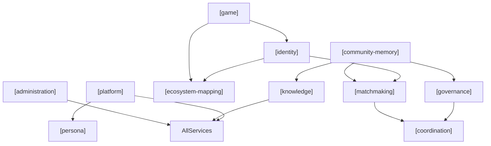

# Requirements: Tramice721 Discord Bot

> Bot design & implementation requirements, extracted from the game document
> `jeu.pdf` ("Un jeu pour système — La Guilde des Tramarades") and reconciled
> with the technical implementation plan (the original milestone plan, M0 to M6).
>
> Requirements use **MUST** / **SHOULD** / **MAY** (RFC-2119 sense).
> Language: English for the engineering team; French terms and persona text are
> preserved verbatim because the bot speaks French (Québec).

---

> **Current slice.** The version being built is [`reliability.md`](reliability.md) (the reliable console), with its test set in [`../testing/acceptance_questions.md`](../testing/acceptance_questions.md). The domain files remain the full service catalog and are not superseded.

## 1. Context

### The game — La Guilde des Tramarades `[knowledge]`

A "serious game" and live-action RPG for an emergent, peer-to-peer economy
based on intelligent communication. Each player is a **trammer** who is
equipped with a personal AI console called a **tramice** (pronounced *tra-miss*,
usable as-is in English). It is described as "a SimCity for the real world":
players recognize, discuss, fund and grow each other's real-world enterprises.

The game is not yet live software. The first playtest happens **on a Discord
server** (the *Laboratoire tramiciel n°721*), where a Discord bot named
**Tramice721** simulates the future tramice, animates the community, and helps
the team refine the rules. **This project builds that bot.**

### What the bot is `[platform]` `[persona]`

The bot **IS Tramice721** — the social AI assistant defined in Annexe D of the
document, not a generic chatbot. It plays two related roles:

- A **social/community AI** in shared channels (multiple trammers talk *with*
the assistant in a salon). `[platform]`
- A **personal tramice** simulation in one-on-one DMs (a single trammer is
sole master of their assistant), foreshadowing the final per-user console.
`[platform]` `[identity]`

### Primary objectives (by service)

| Objective                                                                                             | Service                                    |
| ----------------------------------------------------------------------------------------------------- | ------------------------------------------ |
| Explain and promote the Guilde; answer factual questions about rules, HOP, bookletS, dashboard        | `[knowledge]`                              |
| Help trammers express wishes, discover synergies, connect complementary people                        | `[matchmaking]` `[identity]`               |
| Organize volios, rendezvous, votes; track enterprises, Missions and Quêtes; simulate the weekly cycle | `[coordination]` `[game]` `[identity]`     |
| Summarize debates, map arguments, mediate heated salons, facilitate votes                             | `[governance]`                             |
| Present enterprises/quests and how they evolve; help the team observe the playtest                    | `[ecosystem-mapping]` `[community-memory]` |

---

## 2. Service catalog

The bot's functionality is organized as **services to the community**. Each
service is reflected in the local AI infrastructure and agent harness (tools,
MCP servers, scheduled jobs, SQLite schemas). Requirements are tagged
`[service-name]` throughout this document.

### Core community services

| Tag                   | Service               | Responsibility                                                                                                                                                                                                                              |
| --------------------- | --------------------- | ------------------------------------------------------------------------------------------------------------------------------------------------------------------------------------------------------------------------------------------- |
| `[identity]`          | **Identity**          | Build and maintain profiles of trammers (individuals), enterprises, and Quêtes in local memory. Dashboards for enterprises and Quêtes. Volio, parrainage, trust capital, per-user conversational memory.                                    |
| `[governance]`        | **Governance**        | Decision-making (votes, consensus, 80% rule changes). Conflict resolution and mediation. Social norms (public/private boundaries, admin-configurable). Random selection of trammers as jurors. Ethical charter enforcement in bot behavior. |
| `[matchmaking]`       | **Matchmaking**       | Match wishes/needs of trammers, enterprises, and Quêtes with complementary offers. Surface synergies (Échos). Propose connections — never act on a member's behalf.                                                                         |
| `[coordination]`      | **Coordination**      | Schedule events and meetings. Manage coordination parameters (min/max attendance, time, duration, location). Organize équipes and rendezvous.                                                                                               |
| `[game]`              | **Game**              | Facilitate the weekly cycle and HOP workflow: influence budgets, AUM, Mission/Quête lifecycle, placements, allocations, carnet rules (simulation).                                                                                          |
| `[ecosystem-mapping]` | **Ecosystem mapping** | Presentation and overview of enterprises, Quêtes, Missions, places, and events (Mondo). Track evolution, phases, and stats. Perso vs Cosmo views.                                                                                           |

### Supporting services

| Tag                  | Service              | Responsibility                                                                                                                                              |
| -------------------- | -------------------- | ----------------------------------------------------------------------------------------------------------------------------------------------------------- |
| `[knowledge]`        | **Knowledge**        | RAG over project docs, admin-curated web sources, and (optionally) indexed salon history. Game Q&A grounded in sources. NORA / source attribution. Links to LaTramice.net. |
| `[community-memory]` | **Community memory** | Log readable messages; power summaries, matchmaking, and RAG-over-history. Scheduled activity digests. `/forgetme` and retention policy.                    |
| `[platform]`         | **Platform**         | Discord integration: salons, DMs, triggers, slash commands, permissions, rate limiting, queue, `@everyone` announcements.                                   |
| `[persona]`          | **Persona**          | Tramice n°721 character, voice, and cross-cutting conversational behavior (not a business-logic service, but a presentation layer applied to all services). |
| `[administration]`   | **Administration**   | Model swap, `/reindex`, `/web-source`, config, feature flags, channel allow/deny, scheduled job configuration. |

### Service dependency sketch

---

## Requirements by domain

One file per service domain; the tag in each heading is the one used throughout the docs and the code.

| Domain | File |
|---|---|
| `[persona]` | [`persona.md`](persona.md) |
| `[platform]` | [`platform.md`](platform.md) |
| `[identity]` | [`identity.md`](identity.md) |
| `[matchmaking]` | [`matchmaking.md`](matchmaking.md) |
| `[coordination]` | [`coordination.md`](coordination.md) |
| `[game]` | [`game.md`](game.md) |
| `[ecosystem-mapping]` | [`ecosystem-mapping.md`](ecosystem-mapping.md) |
| `[governance]` | [`governance.md`](governance.md) |
| `[knowledge]` | [`knowledge.md`](knowledge.md) |
| `[community-memory]` | [`community-memory.md`](community-memory.md) |
| `[administration]` | [`administration.md`](administration.md) |
| cross-domain, current slice | [`reliability.md`](reliability.md) |

---

## 7. Implementation mapping (by service)

| Service               | Plan component                                                                     |
| --------------------- | ---------------------------------------------------------------------------------- |
| `[persona]`           | M6 system-prompt Modelfile; `ai/ollama_client.py`                                  |
| `[platform]`          | M1 discord.py client, intents, triggers; `bot/handlers.py` routing                 |
| `[knowledge]`         | M3 RAG: ingest `docs/` → Chroma; curated web via `/web-source` → `web`; `search_knowledge` (docs+web); optional live fetch MCP |
| `[identity]`          | M2/M4 SQLite profiles (volio, enterprise/quest dashboards); LangGraph checkpointer |
| `[matchmaking]`       | M4 agent tools; hourly `propose_echoes` job → Échos inbox (no auto-DM) |
| `[coordination]`      | M4 agent tools; `/todo` channel lists; calendar/scheduling helpers |
| `[game]`              | M5 scheduler jobs; `/support` HOP placements (invest window); `/game-week` admin |
| `[ecosystem-mapping]` | M4 Mondo listings; `/mondo` stats/knowledge/entity views; enterprise dashboards |
| `[governance]`        | M4/M5 agent (summaries, votes, mediation, jury draw, social norms config) |
| `[community-memory]`  | M2 SQLite message log (log allowlist); M5 daily summary job |
| `[administration]`    | M1 `/model`, `/my-model`; M3 `/reindex`, `/web-source`; `/mode` harness; `bot/config.py`; M6 guardrails; post-MVP `/health`, capability scan |

---

## 8. Out of scope

| Item                                                                | Notes                                                 |
| ------------------------------------------------------------------- | ----------------------------------------------------- |
| Full graphical tramice dashboard (Mondo map, animated face UI)      | `[ecosystem-mapping]` text-only simulation on Discord |
| Distributed ledger protocol synchronizing HOP totals across servers | Open "chantier" from game doc                         |
| Legally binding HOP accounting, taxation, currency conversion       | `[game]` is playtest simulation                       |
| Physical booklet (paper)                                            | `[knowledge]` explains; `[game]` does not replace     |
| Facial/biometric identity                                           | `[identity]` uses human parrainage                    |

---

## 9. Open questions

| #   | Question                                                       | Affects                                 |
| --- | -------------------------------------------------------------- | --------------------------------------- |
| 1   | Target guild ID and channel for periodic summaries?            | `[administration]` `[community-memory]` |
| 2   | Channel log vs interact allowlists (privacy notice wording)?  | `[governance]` `[community-memory]`     |
| 3   | Enforce game rules vs merely assist the human-run simulation?  | `[game]` `[governance]`                 |
| 4   | Default LLM "soul" for persona voice (CPU-only constraints)?   | `[persona]` `[administration]`          |
| 5   | Enable `@everyone` announcements, and behind which permission? | `[platform]` `[administration]`         |
| 6   | Social norms: default private/public rules for the playtest?   | `[governance]`                          |
