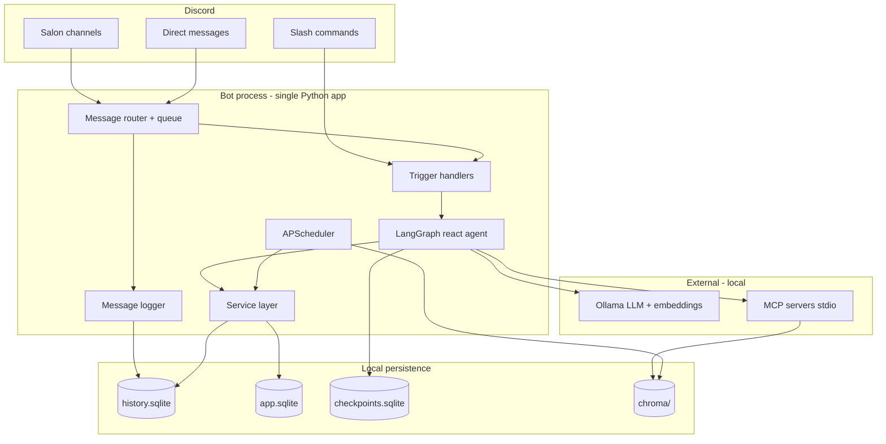

# Specifications — Tramice721 Discord Bot

> Technical specification derived from `[requirements.md](requirements.md)`.
> This document defines **how** the system is built. Requirements define **what**
> it must do. The implementation plan (`.cursor/plans/discord_ai_bot_4b8e92eb.plan.md`)
> defines **when** (milestones M0–M6).


| Field               | Value                                              |
| ------------------- | -------------------------------------------------- |
| Version             | 0.2                                                |
| Status              | Implemented (M0–M6 + post-MVP July 2026)             |
| Primary runtime     | Python 3.12, discord.py 2.7, Ollama (local)        |
| Default LLM         | `qwen2.5:7b-instruct` (per-user override: `/my-model`) |
| Default embed model | `nomic-embed-text`                                 |
| Target environment  | CPU-only, ~15 GB RAM, single Ollama inference slot |


---


## 1. Traceability

Each spec section maps to requirement service tags and IDs.


| Spec §                  | Services                                                  | Requirement refs               |
| ----------------------- | --------------------------------------------------------- | ------------------------------ |
| §3 Architecture         | all                                                       | §2 service catalog             |
| §4 Platform             | `[platform]`                                              | PLT-1…PLT-10                   |
| §5 Data model           | `[identity]` `[game]` `[community-memory]` `[governance]` | IDN-*, GME-*, MEM-*, GOV-10…12 |
| §6 Agent & tools        | all core                                                  | §7 impl mapping                |
| §7 Service modules      | per service                                               | §4 service requirements        |
| §8 Discord interface    | `[platform]` `[administration]`                           | PLT-*, ADM-*                   |
| §9 Scheduler            | `[game]` `[community-memory]` `[knowledge]`               | GME-*, MEM-4, ADM-2            |
| §10 Config & deployment | `[administration]`                                        | ADM-*, PLT-8…10                |
| §11 Security & privacy  | `[governance]` `[community-memory]`                       | GOV-*, MEM-*, NFR-*            |
| §12 Acceptance criteria | all                                                       | milestones M0–M6               |


---


## 2. System overview


### 2.1 Purpose

Tramice721 is a local-first Discord bot that simulates the personal **tramice**
console for the *Laboratoire tramiciel n°721* playtest of **La Guilde des
Tramarades**. It exposes ten logical services (six community + four supporting)
through a single LangGraph react agent backed by MCP tools, SQLite persistence,
and Chroma RAG.

### 2.2 High-level architecture




### 2.3 Design principles

1. **Service-oriented monolith** — one deployable process; services are Python
  modules with explicit interfaces, not separate microservices (v1).
2. **Agent as orchestrator** — the LLM routes user intent to service tools; business
  rules live in service code, not prompt-only logic.
3. **Propose, never dispose** — tools return proposals; no tool may vote, spend
  HOPs, or DM a third party without explicit human confirmation in the same turn.
4. **Privacy by policy** — social norms + channel allowlists gate what is logged,
  embedded, summarized, or shown in profiles.
5. **Simulation, not ledger** — HOP balances and placements are playtest records
  in SQLite, not a distributed financial system.


### 2.4 Project layout

```
discord-ai-bot/
├── bot/
│   ├── main.py              # entrypoint: config, Discord client, scheduler
│   ├── config.py            # .env + config.yaml loader
│   ├── handlers.py          # prefix / mention / slash routing
│   ├── channel_policy.py    # log_allowlist vs interact_allowlist
│   ├── router.py            # rate limiter + single-flight queue
│   ├── discord_client.py    # discord.py setup, intents, events
│   ├── capabilities.py      # permission scan → capabilities.json (post-MVP)
│   ├── discord_actions.py   # threads, scheduled events, soundboard (post-MVP)
│   ├── discord_errors.py    # classified Discord API errors (post-MVP)
│   ├── commands.py          # slash command registration
│   ├── ui.py                # ConfirmView, ModelSelectView
│   └── observability.py     # JSON logs, audit, health, heartbeat
├── services/
│   ├── identity.py          # [identity]
│   ├── matchmaking.py       # [matchmaking]
│   ├── coordination.py      # [coordination]
│   ├── game.py              # [game]
│   ├── ecosystem.py         # [ecosystem-mapping]
│   ├── governance.py        # [governance]
│   ├── knowledge.py         # [knowledge] facade over RAG
│   ├── memory.py            # [community-memory]
│   └── platform.py          # [platform] helpers
├── ai/
│   ├── ollama_client.py
│   ├── persona.py           # [persona] system prompt builder
│   ├── agent/
│   │   ├── state.py
│   │   ├── graph.py
│   │   ├── harness.py       # dual harness (creative vs procedural)
│   │   ├── tool_wrapper.py  # safe tool errors + harness filtering
│   │   └── tools.py         # LangChain tools wrapping services
│   └── rag/
│       ├── ingest.py
│       ├── web_ingest.py    # admin-curated same-domain crawl → Chroma `web`
│       ├── retriever.py
│       └── embeddings.py
├── mcp_servers/
│   ├── discord_helper/server.py
│   ├── rag_server/server.py
│   └── mcp_config.py
├── storage/
│   ├── db.py                # connection + migrations
│   ├── history.py           # message log CRUD
│   └── models.py            # dataclasses / TypedDicts
├── scheduler/
│   └── jobs.py
├── prompts/
│   ├── tramice721_system.txt
│   └── tramice721_modelfile   # Ollama Modelfile (M6)
├── data/                    # gitignored
│   ├── history.sqlite
│   ├── app.sqlite
│   ├── checkpoints.sqlite
│   └── chroma/
├── docs/                    # RAG source: jeu.pdf, requirements.md, specifications.md
├── config.yaml
├── .env.example
└── requirements.txt
```

---


## 3. Runtime components


### 3.1 Message router `[platform]`

**Responsibility:** Accept Discord events, enforce policy, serialize LLM work.


| Parameter                  | Default | Notes                                 |
| -------------------------- | ------- | ------------------------------------- |
| `max_concurrent_llm`       | `1`     | Ollama single-slot on target hardware |
| `per_user_cooldown_sec`    | `10`    | Sliding window                        |
| `per_channel_cooldown_sec` | `5`     | Salon flood control                   |
| `max_queue_depth`          | `20`    | Beyond this → polite busy message     |
| `max_message_chars`        | `4000`  | Truncate with notice before agent     |


**Algorithm:**

1. Ignore messages from bots (`PLT-5`).
2. Check channel interact policy (`PLT-6`; `interact_allowlist` / legacy `allowlist`).
3. Log message if logging enabled for channel (`MEM-1`; `log_allowlist`).
4. If trigger matches → enqueue `AgentRequest`.
5. Worker dequeues one request at a time → invokes LangGraph agent.
6. Post-process response (split if >2000 chars for Discord limit).

```python
@dataclass
class AgentRequest:
    guild_id: str | None
    channel_id: str
    user_id: str
    surface: Literal["salon", "dm"]
    thread_id: str          # f"{user_id}-{channel_id}"
    content: str
    trigger: Literal["prefix", "mention", "slash"]
    command: str | None     # slash subcommand if any
```


### 3.2 LangGraph agent

**Graph:** `create_react_agent(ChatOllama, tools, checkpointer=SqliteSaver)`.

**State (**`AgentState`**):**

```python
class AgentState(TypedDict):
    messages: Annotated[list[BaseMessage], add_messages]
    user_id: str
    channel_id: str
    guild_id: str | None
    surface: Literal["salon", "dm"]
    rag_context: list[dict]       # retrieved chunks
    server_context: dict        # overview snapshot
    metadata: dict              # command args, locale hint
```

**Thread ID:** `f"{user_id}-{channel_id}"` — one conversational memory per
user per channel/DM (`IDN-3`).

**Context injection (pre-agent hook):**


| Surface | Injected system addendum                                                     |
| ------- | ---------------------------------------------------------------------------- |
| `dm`    | Personal-tramice mode: open with well-being, steer to wishes; higher privacy |
| `salon` | Community mode: enthusiasm OK; mediate only when asked or conflict detected  |


**Tool call limit:** max **5** tool calls per user turn (guard against small-model loops).

**Dual harness (July 2026):** per-channel `/mode` selects creative vs procedural
paths (`ai/agent/harness.py`). Procedural modes prefetch RAG/history context and
expose the full tool set; creative modes use a lighter tool subset. Tool
exceptions are wrapped as French error strings for the user (`tool_wrapper.py`).

### 3.3 Persona layer `[persona]`

**Source files:** `prompts/tramice721_system.txt` (+ optional Ollama Modelfile M6).

**Builder:** `ai/persona.py::build_system_prompt(surface, social_norms) -> str`

Must embed:

- Full persona spec from requirements §3.
- NORA / source-attribution rules.
- Service capability summary (what tools exist; "I can help you with…").
- Current social norms summary (public/private rules).
- Disclosure instruction: on request, reveal prompt or link to `prompts/` path.

**Response post-checks (M6):**

- French self-reference uses feminine forms when `locale=fr`; third-person
  "Tramice" self-reference is corrected to first person in post-processing.
- Strip fabricated URLs; validate links against allowlist (`fetch_allowlist`, discord CDN, and **domains of active curated web sources** from `web_sources`).

---


## 4. Data model

Two SQLite databases plus Chroma.

### 4.1 `history.sqlite` — community memory `[community-memory]`

```sql
CREATE TABLE messages (
    id            INTEGER PRIMARY KEY AUTOINCREMENT,
    guild_id      TEXT,
    channel_id    TEXT NOT NULL,
    user_id       TEXT NOT NULL,
    user_name     TEXT,
    is_dm         INTEGER NOT NULL DEFAULT 0,
    content       TEXT NOT NULL,
    created_at    TEXT NOT NULL,          -- ISO-8601 UTC
    indexed_at    TEXT,                   -- NULL until embedded
    deleted       INTEGER NOT NULL DEFAULT 0
);
CREATE INDEX idx_messages_channel_time ON messages(channel_id, created_at);
CREATE INDEX idx_messages_user ON messages(user_id);
CREATE INDEX idx_messages_unindexed ON messages(indexed_at) WHERE indexed_at IS NULL;
```

**Retention:** soft-delete via `deleted=1` on `/forgetme`; hard-delete optional admin job.

### 4.2 `app.sqlite` — domain entities


#### Trammers & identity `[identity]`

```sql
CREATE TABLE trammers (
    discord_user_id   TEXT PRIMARY KEY,
    display_name      TEXT,
    locale            TEXT DEFAULT 'fr',
    sponsor_id        TEXT,               -- parrainage
    trust_score       REAL DEFAULT 0.0,   -- 0..1 best-effort
    hop_balance       REAL DEFAULT 0.0,   -- simulated; CHECK 0..99999.99
    is_tramicien      INTEGER DEFAULT 0,
    profile_json      TEXT,               -- optional structured profile fields
    created_at        TEXT NOT NULL,
    updated_at        TEXT NOT NULL,
    FOREIGN KEY (sponsor_id) REFERENCES trammers(discord_user_id)
);

CREATE TABLE volios (
    id            INTEGER PRIMARY KEY AUTOINCREMENT,
    trammer_id    TEXT NOT NULL,
    kind          TEXT NOT NULL,          -- search|interest|talent|offer|request|placement
    label         TEXT NOT NULL,
    details       TEXT,
    visibility    TEXT DEFAULT 'network', -- private|network|public
    active        INTEGER DEFAULT 1,
    created_at    TEXT NOT NULL,
    FOREIGN KEY (trammer_id) REFERENCES trammers(discord_user_id)
);

CREATE TABLE confidences (
    id            INTEGER PRIMARY KEY AUTOINCREMENT,
    trammer_id    TEXT NOT NULL,
    content       TEXT NOT NULL,
    created_at    TEXT NOT NULL,
    FOREIGN KEY (trammer_id) REFERENCES trammers(discord_user_id)
);
-- Never included in summaries, matchmaking, or public profiles (IDN-6, MEM-3)
```


#### Enterprises & quests `[identity]` `[ecosystem-mapping]` `[game]`

```sql
CREATE TABLE entities (
    id            TEXT PRIMARY KEY,       -- UUID
    kind          TEXT NOT NULL,          -- enterprise|quest|mission|event|place|idea
    owner_id      TEXT NOT NULL,
    title         TEXT NOT NULL,
    description   TEXT,
    phase         TEXT DEFAULT 'draft',   -- draft|active|funded|completed|archived
    transparency  REAL DEFAULT 0.5,       -- 0..1; higher ranks first (ECO-5)
    hop_requested REAL DEFAULT 0.0,
    hop_allocated REAL DEFAULT 0.0,
    location      TEXT,
    metadata      TEXT,                   -- JSON: skills, needs, coords, etc.
    created_at    TEXT NOT NULL,
    updated_at    TEXT NOT NULL,
    FOREIGN KEY (owner_id) REFERENCES trammers(discord_user_id)
);

CREATE TABLE entity_updates (
    id            INTEGER PRIMARY KEY AUTOINCREMENT,
    entity_id     TEXT NOT NULL,
    author_id     TEXT NOT NULL,
    body          TEXT NOT NULL,
    created_at    TEXT NOT NULL,
    FOREIGN KEY (entity_id) REFERENCES entities(id)
);
```


#### Teams & coordination `[coordination]`

```sql
CREATE TABLE teams (
    id            TEXT PRIMARY KEY,
    name          TEXT,
    created_at    TEXT NOT NULL
);

CREATE TABLE team_members (
    team_id       TEXT NOT NULL,
    trammer_id    TEXT NOT NULL,
    joined_at     TEXT NOT NULL,
    PRIMARY KEY (team_id, trammer_id)
);

CREATE TABLE events (
    id            TEXT PRIMARY KEY,
    organizer_id  TEXT NOT NULL,
    title         TEXT NOT NULL,
    starts_at     TEXT,
    duration_min  INTEGER,
    location      TEXT,
    min_attendees INTEGER DEFAULT 1,
    max_attendees INTEGER,
    status        TEXT DEFAULT 'proposed', -- proposed|confirmed|cancelled|done
    metadata      TEXT,                   -- JSON: entity links, tribunal ref, etc.
    created_at    TEXT NOT NULL
);

CREATE TABLE event_rsvps (
    event_id      TEXT NOT NULL,
    trammer_id    TEXT NOT NULL,
    status        TEXT NOT NULL,          -- invited|accepted|declined
    PRIMARY KEY (event_id, trammer_id)
);
```


#### Game simulation `[game]`

```sql
CREATE TABLE game_weeks (
    week_id       TEXT PRIMARY KEY,       -- ISO year-week, e.g. 2026-W28
    starts_at     TEXT NOT NULL,          -- Thursday 17:00 local
    invest_end    TEXT NOT NULL,          -- Sunday 23:59:59 local
    hop_created   REAL DEFAULT 0.0,       -- total HOPs recognized prior week
    growth_factor REAL DEFAULT 1.20,
    influence_min REAL DEFAULT 5.0,
    influence_max REAL DEFAULT 100.0,
    aum_per_trammer REAL DEFAULT 5.0,
    status        TEXT DEFAULT 'open'     -- open|investing|closed
);

CREATE TABLE hop_placements (
    id            INTEGER PRIMARY KEY AUTOINCREMENT,
    week_id       TEXT NOT NULL,
    trammer_id    TEXT NOT NULL,
    entity_id     TEXT NOT NULL,
    hop_amount    REAL NOT NULL CHECK(hop_amount > 0),
    placed_at     TEXT NOT NULL,
    UNIQUE (week_id, trammer_id, entity_id)
);

CREATE TABLE hop_recognitions (
    id            INTEGER PRIMARY KEY AUTOINCREMENT,
    week_id       TEXT,
    entity_id     TEXT NOT NULL,
    trammer_id    TEXT NOT NULL,
    hop_amount    REAL NOT NULL CHECK(hop_amount > 0),
    description   TEXT,
    validated     INTEGER DEFAULT 0,
    created_at    TEXT NOT NULL
);
```

**HOP validation rules (enforced in** `services/game.py`**):**

```python
HOP_MIN = 0.0
HOP_MAX_BALANCE = 99_999.99
HOP_DECIMALS = 2
HOP_MAX_INVEST_PER_WEEK = 100.0
```


#### Governance `[governance]`

```sql
CREATE TABLE social_norms (
    id            INTEGER PRIMARY KEY AUTOINCREMENT,
    key           TEXT NOT NULL UNIQUE,   -- e.g. dm_always_private
    value         TEXT NOT NULL,          -- JSON
    updated_by    TEXT,
    updated_at    TEXT NOT NULL
);

CREATE TABLE votes (
    id            TEXT PRIMARY KEY,
    title         TEXT NOT NULL,
    description   TEXT,
    threshold     REAL DEFAULT 0.80,
    created_by    TEXT NOT NULL,
    status        TEXT DEFAULT 'open',    -- open|passed|failed|cancelled
    closes_at     TEXT,
    created_at    TEXT NOT NULL
);

CREATE TABLE vote_ballots (
    vote_id       TEXT NOT NULL,
    trammer_id    TEXT NOT NULL,
    choice        TEXT NOT NULL,          -- yes|no|abstain
    cast_at       TEXT NOT NULL,
    PRIMARY KEY (vote_id, trammer_id)
);

CREATE TABLE signalements (
    id            INTEGER PRIMARY KEY AUTOINCREMENT,
    reporter_id   TEXT NOT NULL,
    target_id     TEXT,
    level         INTEGER NOT NULL,       -- 1=discomfort, 2=breach, 3=danger
    description   TEXT NOT NULL,
    status        TEXT DEFAULT 'open',
    created_at    TEXT NOT NULL
);

CREATE TABLE tribunals (
    id            TEXT PRIMARY KEY,
    signalement_id INTEGER,
    status        TEXT DEFAULT 'mediation', -- mediation|jury|decided|closed
    decision      TEXT,
    created_at    TEXT NOT NULL
);

CREATE TABLE tribunal_jurors (
    tribunal_id   TEXT NOT NULL,
    trammer_id    TEXT NOT NULL,
    selected_at   TEXT NOT NULL,
    PRIMARY KEY (tribunal_id, trammer_id)
);

CREATE TABLE jurisprudence (
    id            INTEGER PRIMARY KEY AUTOINCREMENT,
    tribunal_id   TEXT NOT NULL,
    summary       TEXT NOT NULL,
    created_at    TEXT NOT NULL
);

CREATE TABLE echoes (
    id            INTEGER PRIMARY KEY AUTOINCREMENT,
    trammer_id    TEXT NOT NULL,          -- recipient
    source_id     TEXT,                   -- trammer or entity
    match_type    TEXT NOT NULL,          -- wish_offer|skill_need|synergy
    summary       TEXT NOT NULL,
    read          INTEGER DEFAULT 0,
    created_at    TEXT NOT NULL
);

-- Post-MVP: activity trace, aliases, per-user model preference
CREATE TABLE activity_traces (
    user_id         TEXT PRIMARY KEY,
    display_name    TEXT,
    first_activity  TEXT,
    last_activity   TEXT,
    message_count   INTEGER NOT NULL DEFAULT 0,
    forgotten_at    TEXT NOT NULL
);

CREATE TABLE member_aliases (
    id            INTEGER PRIMARY KEY AUTOINCREMENT,
    user_id       TEXT NOT NULL,
    name          TEXT NOT NULL,
    first_seen    TEXT NOT NULL,
    last_seen     TEXT NOT NULL,
    is_current    INTEGER NOT NULL DEFAULT 0,
    UNIQUE (user_id, name)
);

CREATE TABLE identity_links (
    user_id_a     TEXT NOT NULL,
    user_id_b     TEXT NOT NULL,
    linked_by     TEXT NOT NULL,
    created_at    TEXT NOT NULL,
    PRIMARY KEY (user_id_a, user_id_b),
    CHECK (user_id_a < user_id_b)
);

CREATE TABLE user_model_prefs (
    discord_user_id   TEXT PRIMARY KEY,
    model             TEXT NOT NULL,
    updated_at        TEXT NOT NULL
);

-- Per-channel conversation mode (/mode) and shared todos (/todo)
CREATE TABLE channel_modes (
    channel_id    TEXT PRIMARY KEY,
    mode          TEXT NOT NULL DEFAULT 'listen',
    updated_at    TEXT NOT NULL
);

CREATE TABLE channel_todos (
    id            INTEGER PRIMARY KEY AUTOINCREMENT,
    channel_id    TEXT NOT NULL,
    body          TEXT NOT NULL,
    status        TEXT NOT NULL DEFAULT 'todo',
    created_at    TEXT NOT NULL,
    updated_at    TEXT NOT NULL
);

-- Curated web sources (admin `/web-source`; shallow same-domain crawl → Chroma `web`)
CREATE TABLE web_sources (
    id               INTEGER PRIMARY KEY AUTOINCREMENT,
    seed_url         TEXT NOT NULL UNIQUE,
    domain           TEXT NOT NULL,
    label            TEXT,
    max_depth        INTEGER NOT NULL DEFAULT 2,
    max_pages        INTEGER NOT NULL DEFAULT 25,
    added_by         TEXT NOT NULL,
    added_at         TEXT NOT NULL,
    last_indexed_at  TEXT,
    last_page_count  INTEGER DEFAULT 0,
    last_chunk_count INTEGER DEFAULT 0,
    last_error       TEXT,
    active           INTEGER NOT NULL DEFAULT 1
);
```


### 4.3 `checkpoints.sqlite`

Managed by `langgraph-checkpoint-sqlite`; no manual schema in spec.

### 4.4 Chroma collections `[knowledge]` `[community-memory]`


| Collection | Source | Chunk strategy |
| ---------- | ------ | -------------- |
| `docs` | `docs/*.pdf`, `docs/*.md`, `docs/*.txt` | 800 tokens, 120 overlap; metadata: `source`, `page` |
| `history` | `messages` where `deleted=0` and policy allows | 400 tokens; metadata: `channel_id`, `user_id`, `created_at` |
| `web` | Admin seed URLs (`web_sources` registry) | Same as `docs`; metadata: `seed_url`, `source_url`, `title`, `fetched_at`, `depth` |

**Web ingest (`ai/rag/web_ingest.py`):** BFS crawl on the **same registrable domain** as the seed URL, up to `rag.web.max_depth` / `max_pages` (per-source overrides via `/web-source add`). HTML only (no JS rendering). SSRF guards block private/localhost targets. Registry in `app.sqlite`; vectors in Chroma `web`. Delete/reindex a source = drop chunks where `seed_url` matches, then re-crawl.


---


## 5. Service module specifications

Each service exposes a Python class with typed methods. The agent accesses them
via LangChain tools in `ai/agent/tools.py` (thin wrappers).

### 5.1 IdentityService `[identity]`

```python
class IdentityService:
    def get_trammer(self, discord_user_id: str) -> Trammer | None: ...
    def upsert_trammer(self, discord_user_id: str, **fields) -> Trammer: ...
    def add_volio_entry(self, trammer_id: str, kind: VolioKind, label: str, ...) -> Volio: ...
    def list_volio(self, trammer_id: str, visibility_filter: str) -> list[Volio]: ...
    def set_sponsor(self, trammer_id: str, sponsor_id: str) -> None: ...
    def record_confidence(self, trammer_id: str, content: str) -> None: ...
    def get_profile_public(self, trammer_id: str) -> dict: ...  # respects IDN-6
    def update_trust_score(self, trammer_id: str) -> float: ...  # recompute IDN-5
```


### 5.2 MatchmakingService `[matchmaking]`

```python
class MatchmakingService:
    def find_synergies(self, trammer_id: str, limit: int = 5) -> list[EchoMatch]: ...
    def match_volios(self, criteria: MatchCriteria) -> list[ProposedMatch]: ...
    def create_echo(self, recipient_id: str, summary: str, ...) -> Echo: ...
    def list_echoes(self, trammer_id: str, unread_only: bool = False) -> list[Echo]: ...
```

**Matching algorithm (v1):** keyword + embedding similarity over volios and
open entity `metadata.needs` / `metadata.offers`; score = cosine × trust_weight.
No auto-DM: returns `ProposedMatch` for agent to present (`MTM-3`).

### 5.3 CoordinationService `[coordination]`

```python
class CoordinationService:
    def propose_event(self, organizer_id: str, spec: EventSpec) -> Event: ...
    def rsvp(self, event_id: str, trammer_id: str, status: RsvpStatus) -> None: ...
    def create_team(self, member_ids: list[str], name: str | None) -> Team: ...
    def list_upcoming_events(self, trammer_id: str | None = None) -> list[Event]: ...
```


### 5.4 GameService `[game]`

```python
class GameService:
    def get_current_week(self) -> GameWeek: ...
    def advance_week_phase(self) -> GameWeek: ...       # scheduler + admin only
    def publish_mission(self, owner_id: str, spec: MissionSpec) -> Entity: ...
    def publish_quest(self, owner_id: str, spec: QuestSpec) -> Entity: ...
    def compute_influence_budget(self, week_id: str) -> float: ...
    def place_hops(self, trammer_id: str, entity_id: str, amount: float) -> Placement: ...
    def move_hops(self, trammer_id: str, from_entity_id: str, to_entity_id: str, amount: float) -> None: ...
    def recognize_work(self, entity_id: str, trammer_id: str, hops: float, ...) -> Recognition: ...
    def get_trammer_balance(self, trammer_id: str) -> float: ...  # enforces GME-5
```

**Weekly cycle timezone:** `America/Montreal` (configurable). Placements rejected
outside Thu 17:00 – Sun 23:59 when week status is not `investing`/`open`.
Scheduler fires:

- Thu 17:00 → open investment, publish budget announcement
- Sun 23:59 → close investment, finalize allocations


### 5.5 EcosystemService `[ecosystem-mapping]`

```python
class EcosystemService:
    def list_mondo(self, view: Literal["perso", "cosmo"], trammer_id: str | None,
                   filters: MondoFilters) -> list[EntityCard]: ...
    def get_entity_dashboard(self, entity_id: str, week_id: str | None = None) -> dict: ...
    def get_social_stats(self) -> dict: ...
    def get_playtest_stats(self) -> PlaytestStats: ...
```

**Ranking (Cosmo):** `urgency DESC, transparency DESC, hop_requested DESC`.
**Ranking (Perso):** filter by volio affinity + trust network depth ≤2.

### 5.6 GovernanceService `[governance]`

```python
class GovernanceService:
    def summarize_channel(self, channel_id: str, since: str, until: str) -> Summary: ...
    def summarize_debate(self, message_ids: list[int]) -> DebateSynthesis: ...
    def create_vote(self, creator_id: str, spec: VoteSpec) -> Vote: ...
    def cast_ballot(self, vote_id: str, trammer_id: str, choice: str) -> BallotResult: ...
    def get_social_norms(self) -> dict: ...
    def set_social_norm(self, admin_id: str, key: str, value: dict) -> None: ...
    def file_signalement(self, reporter_id: str, spec: SignalementSpec) -> Signalement: ...
    def draw_jury(self, tribunal_id: str, pool_guild_id: str, size: int = 7) -> list[str]: ...
    def record_jurisprudence(self, tribunal_id: str, summary: str) -> None: ...
```

**Jury draw:** uniform random sample from active trammers excluding conflicted
parties (`GOV-8`); seed logged for audit.

### 5.7 KnowledgeService `[knowledge]`

```python
class KnowledgeService:
    def search(self, query: str, collections: list[str] | None = None,
               k: int = 5) -> list[RetrievalChunk]: ...  # default: docs + web
    def explain_topic(self, topic: str) -> GroundedAnswer: ...
    def reindex(self, scope: Literal["docs", "web", "all"] = "docs") -> dict: ...
    def add_web_source(self, url: str, added_by: str, *, label: str | None = None,
                       max_depth: int | None = None, max_pages: int | None = None) -> dict: ...
    def list_web_sources(self) -> list[WebSource]: ...
    def remove_web_source(self, url_or_id: str) -> dict: ...
    def export_public_rag(self) -> int: ...  # snapshots to data/public_rag/
    def web_source_domains(self) -> list[str]: ...  # for output link allowlist
```

Wraps `ai/rag/retriever.py` and `ai/rag/web_ingest.py`; every `GroundedAnswer` includes `sources[]`. Agent `search_knowledge` queries **`docs` + `web`** (not `history` unless explicitly requested).

### 5.8 MemoryService `[community-memory]`

```python
class MemoryService:
    def log_message(self, msg: DiscordMessageSnapshot) -> int: ...
    def forget_user(self, user_id: str) -> ForgetResult: ...
    def fetch_history(self, channel_id: str, limit: int, since: str | None) -> list: ...
    def build_daily_summary(self, guild_id: str) -> Summary: ...
```

---


## 6. Agent tools & MCP servers


### 6.1 LangChain tools (agent-facing)


| Tool name               | Service             | Milestone |
| ----------------------- | ------------------- | --------- |
| `search_knowledge`      | KnowledgeService    | M3        |
| `get_trammer_profile`   | IdentityService     | M4        |
| `update_volio`          | IdentityService     | M4        |
| `find_matches`          | MatchmakingService  | M4        |
| `list_echoes`           | MatchmakingService  | M4        |
| `propose_event`         | CoordinationService | M4        |
| `list_mondo`            | EcosystemService    | M4        |
| `get_entity`            | EcosystemService    | M4        |
| `get_game_week`         | GameService         | M5        |
| `place_hops`            | GameService         | M5        |
| `publish_mission`       | GameService         | M5        |
| `summarize_channel`     | GovernanceService   | M4        |
| `create_vote`           | GovernanceService   | M5        |
| `get_server_overview`   | MCP discord_helper  | M4        |
| `get_guild_metadata`    | MCP discord_helper  | P15       |
| `fetch_channel_history` | MCP discord_helper  | M4        |


Each tool schema includes: `name`, `description` (French-friendly), typed
`parameters`, and `requires_confirmation: bool` where human approval is needed
(`place_hops`, `propose_event`, `create_vote`, `cast_ballot`).

### 6.2 MCP: `discord_helper` `[platform]` `[ecosystem-mapping]`

```python
@mcp.tool()
def get_server_overview(guild_id: str) -> dict:
    """Channel list, member count, recent activity stats."""

@mcp.tool()
def get_guild_metadata() -> dict:
    """Guild name, channel list, roles summary (from live Discord + config allowlists)."""

@mcp.tool()
def fetch_channel_history(channel_id: str, limit: int = 50,
                          since_iso: str | None = None) -> list[dict]:
    """Recent messages from SQLite log (not live Discord API unless needed)."""
```

Transport: **stdio**. Launch via `mcp_servers/mcp_config.py`.

### 6.3 MCP: `rag_server` `[knowledge]`

```python
@mcp.tool()
def semantic_search_docs(query: str, collection: str = "docs", k: int = 5) -> list[dict]:
    """Vector search over Chroma. collection: docs | web | history | all (docs+web)."""
```


### 6.4 MCP: fetch (optional, live) vs curated web RAG `[knowledge]`

**Curated web RAG (implemented):** admins register seed URLs via `/web-source add`; the bot crawls and embeds into Chroma `web`. This is the primary path for LaTramice.net and other trusted sites (KNW-3).

**Optional live fetch (not enabled by default):** read-only `uvx mcp-server-fetch` when `features.web_fetch: true`. Gated by `fetch_allowlist` if `rag.web.require_allowlist: true`. Separate from curated ingest — do not enable both for the same use case unless intentional.

---


## 7. Discord interface `[platform]` `[administration]`


### 7.1 Intents & permissions


| Discord intent    | Required |
| ----------------- | -------- |
| `message_content` | Yes      |
| `members`         | Yes      |
| `guilds`          | Yes      |


| Permission               | Use             |
| ------------------------ | --------------- |
| Send Messages            | replies         |
| Read Message History     | context         |
| Use Slash Commands       | slash cmds      |
| Send Messages in Threads | optional        |
| Mention @everyone        | gated (`ADM-4`) |


### 7.2 Triggers


| Trigger | Pattern                 | Behavior                     |
| ------- | ----------------------- | ---------------------------- |
| Prefix  | `!ai <message>`         | strip prefix, route to agent |
| Mention | `@Tramice721 <message>` | strip mention                |
| Slash   | see §7.3                | structured commands          |


Config key: `triggers.prefix` default `!ai`.

### 7.3 Slash commands


| Command        | Service        | Access | Description                                  |
| -------------- | -------------- | ------ | -------------------------------------------- |
| `/ask`         | agent          | all    | Ask Tramice721 (optional `question` param)   |
| `/summarize`   | governance     | all    | Summarize current channel (optional `hours`) |
| `/volio`       | identity       | all    | List or add a volio entry                    |
| `/mondo`       | ecosystem      | all    | Mondo views: `perso`, `cosmo`, `stats`, `knowledge`, `entity` |
| `/echoes`      | matchmaking    | all    | List unread Échos                            |
| `/mission`     | game           | all    | Publish or view Missions                     |
| `/support`     | game           | all    | Place, withdraw, move, or list HOP influence (confirm) |
| `/vote`        | governance     | all    | View/open votes                              |
| `/event`       | coordination   | all    | Propose or list events                       |
| `/signal`      | governance     | all    | File graduated report                        |
| `/forgetme`    | memory         | all    | Delete user's stored data (retains activity trace) |
| `/norms`       | governance     | all    | Show social norms                            |
| `/my-model`    | administration | all    | Choose personal Ollama model (dropdown)      |
| `/mode`        | persona        | all    | Set conversation mode / harness for channel |
| `/todo`        | coordination   | all    | Shared todo list for the channel             |
| `/identity`    | identity       | all    | List known names or link identities          |
| `/thread`      | platform       | all    | Create a channel thread                      |
| `/poll`        | platform       | all    | Publish a Discord poll                       |
| `/son`         | platform       | all    | List soundboard sounds                       |
| `/reindex`     | administration | admin  | Rebuild RAG index (`scope`: docs, web, or all) |
| `/web-source`  | administration | admin  | **Group:** `add` / `list` / `remove` curated web sources |
| `/model`       | administration | admin  | Swap community default Ollama model          |
| `/set-norm`    | governance     | admin  | Update a social norm                         |
| `/game-week`   | game           | admin  | View or edit weekly game parameters          |
| `/health`      | administration | admin  | Runtime + Discord health snapshot            |
| `/say`         | platform       | admin  | Send TTS message (`features.tts`)            |


**Confirmation pattern:** for mutating game/governance actions, respond with
Discord embed + `✅ Confirmer` / `❌ Annuler` buttons (`discord.ui.View`).

### 7.4 Surface-specific behavior


| Aspect           | Salon                                    | DM                                        |
| ---------------- | ---------------------------------------- | ----------------------------------------- |
| Opening          | Respond to trigger only                  | Well-being check if no precise request    |
| Emoji use        | Encouraged on progress                   | Moderate                                  |
| Mediation        | Only when asked or `/summarize` conflict | Available on "Résolvons un problème" mode |
| Logging          | per channel policy                       | always private tier                       |
| Profile exposure | public/network fields only               | full volio + confidences                  |


---


## 8. Scheduler jobs `[game]` `[community-memory]` `[knowledge]`


| Job ID                   | Cron (Montreal) | Action                                      |
| ------------------------ | --------------- | ------------------------------------------- |
| `index_new_messages`     | `0 2 * * *`     | Embed unindexed messages → Chroma `history` |
| `refresh_knowledge_base` | `0 3 * * 0`     | Re-ingest `docs/` if changed                |
| `refresh_web_sources`    | `30 3 * * 0`    | Re-crawl all active `web_sources` → Chroma `web` |
| `build_daily_summary`    | `0 8 * * *`     | Post summary to `summary_channel_id`        |
| `game_week_open`         | `0 17 * * 4`    | Open investment window; announce budgets; optional Discord event |
| `game_week_close`        | `59 23 * * 0`   | Close window; finalize allocations          |
| `propose_echoes`         | `0 * * * *`     | Hourly synergy batch → Échos inbox (no DMs) |
| `capability_scan`        | `0 4 * * *`     | Refresh `data/capabilities.json` (post-MVP) |


All jobs log start/end + row counts to structured logger.

---


## 9. Configuration


### 9.1 Environment (`.env`)

```bash
DISCORD_TOKEN=
OLLAMA_HOST=http://127.0.0.1:11434
GUILD_ID=                    # primary lab server
ADMIN_ROLE_IDS=              # comma-separated
DISCORD_LOG_LEVEL=WARNING    # set INFO for first-connect diagnostics
```


### 9.2 `config.yaml`

```yaml
bot:
  name: "Tramice721"
  prefix: "!ai"
  locale_default: fr
  timezone: America/Montreal

llm:
  model: qwen2.5:7b-instruct
  temperature: 0.7
  max_tokens: 2048
  embed_model: nomic-embed-text

channels:
  log_mode: allowlist          # allowlist | denylist | all
  interact_allowlist: []       # bot replies / triggers
  log_allowlist: []            # message logging (may be superset)
  denylist: []
  summary_channel_id: null

features:
  game_simulation: true
  matchmaking: true
  web_fetch: false
  everyone_announcements: false
  tts: true                    # admin /say

governance:
  escalation_threshold: 3      # open signalements before admin DM suggestion

rate_limit:
  per_user_cooldown_sec: 10
  per_channel_cooldown_sec: 5
  max_queue_depth: 20

rag:
  chunk_size: 800
  chunk_overlap: 120
  collections: [docs, history, web]
  web:
    max_depth: 2
    max_pages: 25
    fetch_timeout_sec: 15
    require_allowlist: false   # true = seed domain must match fetch_allowlist
    user_agent: "Tramice721-RAG/1.0"

privacy:
  dm_always_private: true
  confidences_never_shared: true

social_norms_defaults:
  dm_always_private: true
  transaction_details_general: true
  personal_addresses_hidden: true

fetch_allowlist:
  - latramice.net
  - la-tramice.net
```


### 9.3 Default social norms (bootstrapped into `social_norms` table)


| Key                           | Default | Effect                                           |
| ----------------------------- | ------- | ------------------------------------------------ |
| `dm_always_private`           | `true`  | DMs excluded from public summaries and Cosmo     |
| `confidences_never_shared`    | `true`  | `confidences` table never in RAG/history exports |
| `personal_addresses_hidden`   | `true`  | Strip/limit address fields in public profiles    |
| `transaction_details_general` | `true`  | HOP transaction descriptions default to general  |


---


## 10. Security, privacy & guardrails


### 10.1 Access control


| Action            | Check                                                 |
| ----------------- | ----------------------------------------------------- |
| Admin commands    | `user` has role in `ADMIN_ROLE_IDS` or is guild owner |
| `/web-source add` | admin only; SSRF validation on seed URL                |
| Channel logging   | `log_mode` + allow/deny lists                         |
| Tool mutations    | confirmation UI + audit row in SQLite                 |
| `/forgetme`       | only requesting user's data                           |


### 10.2 Data classification


| Class     | Examples                      | Storage               | RAG | Summaries  | Profiles     |
| --------- | ----------------------------- | --------------------- | --- | ---------- | ------------ |
| `public`  | Mondo entities, public volios | app.sqlite            | yes | yes        | yes          |
| `network` | volio network visibility      | app.sqlite            | yes | anonymized | members only |
| `private` | DMs, confidences              | history + confidences | no  | no         | owner only   |
| `admin`   | social norm config            | app.sqlite            | no  | no         | admin only   |


### 10.3 Input/output sanitization (M6)

- Strip `@everyone` / `@here` from user input to agent.
- Web crawl (`/web-source add`): http(s) only; DNS resolved to public IPs; optional `rag.web.require_allowlist`.
- Max tool-result size 8 KB per call (truncate with pointer).
- Block output of other users' `private` data unless requester is owner or admin.


### 10.4 Audit log (M6)

Append-only `audit.log` JSON lines: `{ts, user_id, action, tool, args_hash, result}`.

---


## 11. Error handling & observability


### 11.1 User-facing errors (French)


| Condition         | Message                                                                          |
| ----------------- | -------------------------------------------------------------------------------- |
| Queue full        | "Je suis un peu débordée en ce moment — réessaie dans un instant."               |
| Ollama down       | "Mon moteur de réflexion est indisponible. Vérifie qu'Ollama tourne."            |
| RAG miss          | "Je n'ai pas trouvé de source fiable — voici ce que je peux dire avec prudence…" |
| Permission denied | "Je n'ai pas la permission pour cette action."                                   |


### 11.2 Logging

Structured JSON to stdout (M6): `level`, `event`, `guild_id`, `channel_id`,
`user_id`, `duration_ms`, `model`, `tool_calls`.

### 11.3 Health checks

- On startup: ping Ollama `/api/tags`, verify SQLite writable, Chroma reachable;
  run capability scan when `GUILD_ID` is set.
- `/health` admin slash: Ollama, SQLite, Chroma, scheduler jobs, gateway
  latency, router queue, last capability scan, event/job error counters.

---


## 12. Milestone acceptance criteria


### M0 — Foundation

- [x] Repo structure matches §2.4
- [x] `config.yaml` + `.env.example` load without error
- [x] `storage/db.py` creates `app.sqlite` + `history.sqlite` schemas


### M1 — Working bot `[platform]` `[persona]`

- [x] Bot connects to Discord; responds to `!ai`, `@mention`, `/ask`
- [x] Direct Ollama call with persona system prompt
- [x] `/model` swaps model at runtime
- [x] Does not reply to other bots


### M2 — Persistence `[community-memory]` `[identity]`

- [x] All readable messages logged per channel policy
- [x] `/forgetme` soft-deletes user messages + profile rows
- [x] LangGraph checkpointer restores multi-turn DM context


### M3 — RAG `[knowledge]`

- [x] `docs/jeu.pdf` + `requirements.md` ingested into Chroma
- [x] `/ask` about HOP / weekly cycle returns grounded answer with source hint
- [x] `/reindex` rebuilds index (scoped: docs, web, or all)
- [x] Admin-curated web RAG: `/web-source`, Chroma `web`, `refresh_web_sources`


### M4 — MCP & services

- [x] `discord_helper` + `rag_server` wired via MultiServerMCPClient
- [x] `/volio`, `/mondo`, `/echoes`, `/summarize` functional
- [x] Matchmaking proposes connections; no auto-DM
- [x] Social norms readable via `/norms`


### M5 — Scheduling & game `[game]` `[governance]`

- [x] Nightly message indexing job runs
- [x] Daily summary posts to configured channel
- [x] Weekly game open/close jobs fire; `/support` and `/mission` work with confirmation
- [x] `/vote` creates vote; ballots tallied against threshold


### M6 — Production hardening

- [x] Ollama Modelfile for persona
- [x] Rate limiter + queue tuned under load
- [x] Audit log + health check
- [x] README with deploy steps (venv, ollama pull, systemd optional)

---


## 13. Out of scope (v1)

Per requirements §8: graphical Mondo UI, distributed HOP ledger, legal/tax
accounting, physical booklets, biometric identity, multi-server sync protocol.

---


## 14. Open decisions (blockers)


| #   | Decision                                      | Status / recommendation        |
| --- | --------------------------------------------- | ------------------------------ |
| 1   | `GUILD_ID` + `summary_channel_id`             | Set in lab deployment          |
| 2   | `log_allowlist` vs `interact_allowlist`       | Set in lab deployment          |
| 3   | Game enforce vs assist                        | **Assist** for playtest        |
| 4   | Default LLM soul                              | `qwen2.5:7b-instruct`; `/my-model` for experiments |
| 5   | `@everyone` enabled?                          | Deferred; capability tracked   |
| 6   | Default social norms for playtest             | Seeded in §9.3; `/set-norm`    |


---


## 15. Post-MVP additions (July 2026)

Implemented after M6; see [`implementation_status.md`](implementation_status.md)
(Post-MVP round + Planning pass P1–P15). Deferred leftovers: [`post_mvp.md`](post_mvp.md).

| Area | Deliverable |
| ---- | ----------- |
| Privacy | `activity_traces` on `/forgetme` |
| Identity | `member_aliases`, `identity_links`, `/identity`, `profile_json` |
| Platform | Capability scan, `/thread`, `/poll`, `/say`, `/son`, `/mode`, `/todo` |
| Coordination | Discord scheduled events on `/event` + `game_week_open` |
| Game | `/support` move/withdraw, invest window, `/game-week` |
| Ecosystem | `/mondo` stats/knowledge/entity, `entity_updates`, public RAG export |
| Matchmaking | Hourly `propose_echoes` job (inbox only) |
| Agent | Dual harness, tool failure feedback, `get_guild_metadata` |
| Governance | Moderation DM suggestions (`governance.escalation_threshold`) |
| Ops | `discord_errors.py`, expanded `/health`, `DISCORD_LOG_LEVEL` |


---


## 16. Glossary (spec usage)


| Term    | Spec meaning                                               |
| ------- | ---------------------------------------------------------- |
| Trammer | Discord server member / player (requirements: *tramarade*) |
| Tramice | Personal AI console; this bot simulates it                 |
| Volio   | Profile chest: wishes, talents, offers, requests           |
| Échos   | Matchmaking inbox notifications                            |
| Mondo   | Ecosystem map (text/embed rendering on Discord)            |
| HOP     | Hour of work unit (simulated, 2 decimal places)            |
| Entity  | DB row: enterprise, quest, mission, event, place, or idea  |
| Surface | `salon` (channel) or `dm` (direct message)                 |


