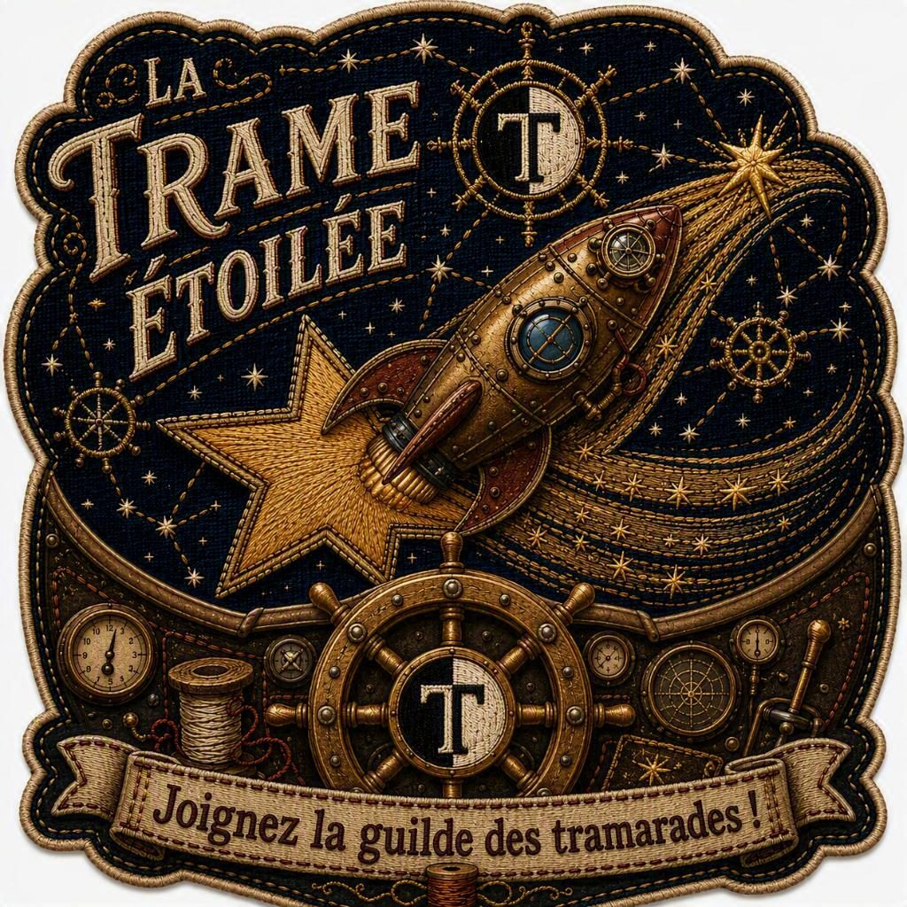
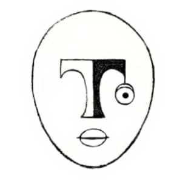

# The tramiciel domain

> **Sources.** Frédo's specification in the working document, tab *Spécifications _ docs*, section *En développement : l'écosystème tramiciel*; the third-pass reading of that specification dated 26 August 2026; *Un jeu pour système* and its five annexes; the lab session of 9 September 2026. Where a statement is Frédo's specification it is stated plainly. Where it is a reading offered from the development side it is marked **(reading)** and is his to accept or drop.

  

## Why this folder exists

The rest of `docs/` describes one Discord bot. That bot is not the project. The project is **a network of tramices**, and this bot is one of them: **Tramice 7-21**, the tramice of the tramiciel laboratory n°721, which is currently pretending to be three other kinds of tramice because those do not exist yet.

Nothing in `requirements/` or `design/` makes sense without that frame. A reader meets `#trammer`, *volio*, *écho*, HOP and *appui* on the first page of the reliability slice and has nowhere to look them up. A reader wonders why the bot is numbered 7-21 and finds no answer. This folder is that answer.

## What a tramice is

A tramice is an entity of the Trame with a **tramicule**: a series digit, a hyphen, then a free suffix of one or more digits. `Tramice 7-21` is the canonical form and `Tramice721` is an accepted shorthand.

The leading digits are not a serial number. They say what the tramice **is**. Frédo has specified eleven series, T-0 through T-10, and no number is left unclaimed:

| | | |
|---|---|---|
| **0** witnesses | **1** accompanies | **2** draws |
| **3** maps | **4** remembers | **5** recounts |
| **6** reconciles | **7** works | **8** matches |
| **9** specialises | **10** welcomes | |

The whole catalogue is framed as *à implémenter plus tard mais à prévoir tout de suite*: to be built later, to be planned for now.

  

A tramice's identity is a record, not a model. Tramice 7-21 has already survived one model swap, reactivated in July 2026 *avec une nouvelle âme (LLM)*, and kept its name, its character and its memory. What underneath is swappable; what is written down is not.

## Where this repository sits

This repository is **one T-7**, a lab tramice, whose lab happens to be building the Trame itself. While the other series do not exist, it openly simulates three of them:

| It simulates | Where | For how long |
|---|---|---|
| A set of **T-1** personal consoles | Discord direct messages | Until the first real T-1 exists |
| A **T-8** wish oracle | The matchmaking service | Until the first real T-8 exists |
| A **T-0** witness | The game-state and statistics services | Until the first real T-0 exists |

**The simulation is an open fact, never a disguise.** A simulated series announces itself in every answer that depends on the difference. That is a rule, not a courtesy: the failure mode is not the pretending, it is the pretending going unlabelled, and a T-1's privacy guarantee turning out to have been a T-7 all along.

## Read in this order

| Page | What it answers |
|---|---|
| [The ten series](series.md) | What each kind of tramice is, what it may start, what it may answer, what it may never do |
| [The protocol](protocol.md) | How a tramice comes to exist, how tramices reach each other and reach people, what stays local and what travels |
| [The lexicon](lexicon.md) | Every term this project uses, in French and English |
| [Open questions](open-questions.md) | What is not decided, and whose answer it is |

## A note on language

These pages are in English because that is where the technical work happens, and because the repository's other documentation is in English. Every term of the game keeps its French form and is defined in both languages in the [lexicon](lexicon.md). If Frédo would rather think about this in French, it gets rewritten; the question is open and recorded as [question 08](open-questions.md).
